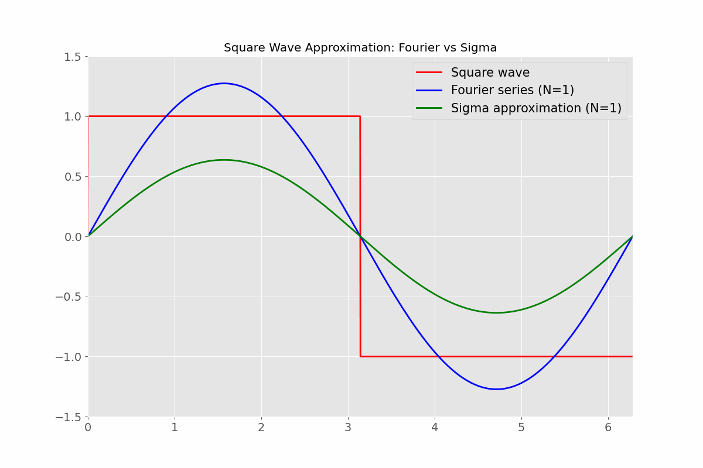
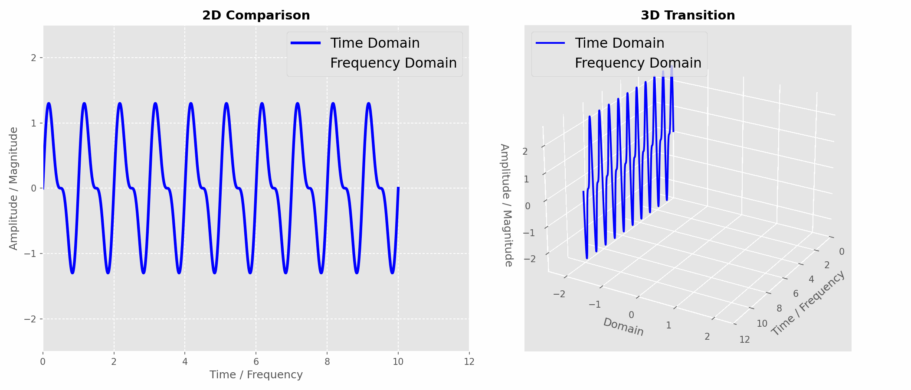

## About Me

From 2022-2025, I worked as a Postdoctoral Fellow at TIFR, Bangalore, at the intersection of geophysical fluid dynamics and computational modeling. My research focused on waves-eddies interactions using pseudo-spectral methods, numerical modeling, turbulence analysis, and reproducible computational workflows.

I hold a Ph.D. in Mechanical Engineering from IIT Indore (2021), where I specialized in heat transfer and bluff-body flow control using computational fluid dynamics (CFD) <a href="./assets/img/bluff_bodies_flows_control_techniques.mp4" target="_blank">(🔊watch here)</a>. My doctoral research explored natural, forced, and mixed convection in complex geometries, employing methods such as the finite volume and lattice Boltzmann methods. Much of this work was carried out using in-house Fortran code developed for numerical simulations.

My teaching career included appointments as Assistant Professor at Technocrats Institute of Technology (Excellence), Bhopal: first from 2011-2012, and later from 2013-2014. These roles gave me valuable exposure to academic life and strengthened my motivation to pursue doctoral research.

I completed my M.Tech. in Thermal Engineering at MANIT Bhopal in 2010. My thesis focused on computational fluid dynamics (CFD) modeling of solar air heaters <a href="./assets/img/Solar_energy_presentation_low.mp4" target="_blank">(🔊 watch here)</a>, which introduced me to advanced numerical methods and renewable energy applications. The work later received citations, a recognition that meant a great deal to me as it marked the true beginning of my research career. From 2004-2008, I pursued a Bachelor of Engineering (B.E.), which deepened my interest in fluid mechanics and thermal sciences. 

My academic path spans doctoral and postdoctoral research, teaching, and technical mentoring. I have qualified for the GATE exam multiple times, contributed to peer-reviewed journals, and participated in national and international workshops. I am also working on high-performance scientific computing, including the parallelization of simulations using Python MPI.

Creativity has always played a role in my work, from designing logos to building academic websites and contributing to science outreach. This page offers a glimpse; the full story brings together research, teaching, design, and discovery.

## Research Interests

- 
Geophysical fluid dynamics (GFD)
 
  - 
Waves-eddies interactions in the ocean

- 
Computational fluid dynamics

  - 
Bluff body flows at low _Re_ 

    - 
Fluid flow behavior and heat transfer 

    - 
Nanofluid-based heat transfer
    
    - 
Flow control

      - 
Flow through porous media

  - 
Thermal analysis of solar air heaters
<!-- - **Computer Vision:** image recognition, image generation, video captioning - **Machine Learning:** meta-learning, incremental learning, transfer learning -->

## Education

- **Ph.D.** (November 2021) IIT Indore, Madhya Pradesh, India.
- **M.Tech** (2010) NIT Bhopal, Madhya Pradesh, India.
- **B.E.** (2008), RGPV, Bhopal, Madhya Pradesh, India.

## Teaching/Research Experience

- [x] **Teaching** (2011 - 2014).
- [x] **Postdoctoral fellow** (2022 - 2025) TIFR, Bangalore, Karnataka, India.
- [ ] Loading....:electron:
  


## Learning Through Illustrations  
(a resource with images and GIFs sourced partly from the internet to clarify ideas)

### Cross Product

In vector calculus, the cross product of two vectors **a × b** produces a third vector, following the right-hand rule. This GIF illustrates the four fundamental cases of the cross product **a × b**: in the general case two vectors lying in a plane produce a perpendicular vector following the right‑hand rule, with magnitude ‖a × b‖ = ‖a‖‖b‖sinθ representing the area of the parallelogram they span; when the vectors are perpendicular the cross product reaches its maximum value, giving the strongest rotational effect such as pushing a swing sideways; when the vectors are parallel or in the same direction the cross product vanishes, showing no perpendicular component and no torque, like pushing a door along its hinge line; and swapping the order of the vectors reverses the perpendicular direction, encoding orientation as in angular momentum or magnetic force. These stages demonstrate how the cross product connects geometry with practical phenomena like torque, rotation, and vorticity in daily life and fluid mechanics.

### Trigonometry in Motion

This visualization links the geometric definitions of sine, cosine, and tangent on the unit circle to their corresponding graphs over the interval 0 to 2π. As the angle θ rotates counterclockwise from the positive x-axis, the horizontal leg of the triangle represents cos θ, the vertical leg represents sin θ, and the tangent line (extending from the angle) illustrates tan θ. Below the circle, the graphs show how these values evolve: sine and cosine oscillate smoothly between -1 and 1, while tangent exhibits vertical asymptotes at odd multiples of π/2, where it becomes undefined. This animation bridges geometry and analysis, helping us understand periodicity, amplitude, and discontinuities; concepts that appear in wave physics, signal processing, and rotational motion in daily life.

### Tangents in Action

In calculus, the slope of a tangent line represents the derivative (f(x) → f'(x)), or the instantaneous rate of change of a function at a given point. A positive slope (f'(x) > 0) means the function is rising, much like a car accelerating as you press the pedal or your savings growing with interest; a negative slope (f'(x) < 0) indicates decline, similar to a cooling cup of tea losing heat or a vehicle slowing down when brakes are applied. A zero slope (f'(x) = 0) corresponds to a flat tangent, marking critical points such as peaks, troughs, or equilibrium states, just as a ball pauses momentarily at the top of its trajectory before falling. These simple slope categories are the foundation of analyzing change in engineering, physics, economics, and daily life, allowing us to predict growth, decay, and balance in systems ranging from fluid flows and heat transfer to financial trends and personal routines.

### Approximating a Square Wave: Harmonics in Action

This animation illustrates how a square wave - a discontinuous signal - can be approximated using two mathematical techniques: the Fourier series and the Sigma (Cesàro) approximation.  
Square wave definition:  f(t) = sign(sin t).
A function that alternates between +1 and -1, capturing the “on/off” nature of a square signal.

Fourier series approximation: Any periodic function can be written as a sum of sines and cosines. For an odd square wave, only odd sine terms remain.

fₙ(t) = Σ (4/π) · (1/k) · sin(k·t),   k = 1,3,5,…,N. 
Adding more odd harmonics sharpens the edges, but introduces Gibbs overshoot near discontinuities.

Sigma approximation (Fejér weighted):  
σₙ(t) = Σ (1 − k/(N+1)) · (4/π) · (1/k) · sin(k·t),   k = 1,3,5,…,N.
Weighted averaging smooths oscillations, giving a closer match to the ideal square wave.

General relation: ‖f(t) − fₙ(t)‖ → 0 as N → ∞, both fₙ(t) and σₙ(t) converge toward f(t), showing how infinite harmonics reconstruct the discontinuous square wave. As N increases, both approximations improve. 

Practical link: This process mirrors real signals — for example, digital audio or square electrical pulses are never perfectly sharp, but approximated by finite harmonics. Engineers use Fourier analysis to understand bandwidth, filter design, and how sharp transitions carry high‑frequency energy.

### From Time to Frequency: A Transform in Perspective

This animation illustrates how a signal transforms between the time domain and the frequency domain, with the left plot showing a smooth blue waveform gradually giving way to red spikes that reveal its harmonic components, while the right 3D plot separates these two views along a Domain axis to highlight the transition; in signal processing this Fourier transform acts like a prism that decomposes oscillations into their hidden frequencies, and the same principle underpins fluid mechanics and turbulence research, where velocity fluctuations in a turbulent jet or vortex field are analyzed in the frequency domain to uncover energy spectra, identify dominant eddies, and distinguish between large-scale coherent structures and small-scale dissipative motions-whether diagnosing vibrations in engineering systems or studying energy cascades in geophysical flows, the ability to switch between time and frequency perspectives is what turns raw oscillations into physical insight.

<!-- - **Research Experience** (2022 - till date) 

##  Lectures/Workshop/Training Programmes Attended 

- 
Yet to be updated...

## National/International Courses Attended 

- 
Yet to be updated...

## News 

- 
Yet to be updated...

- **[Feb. 2020]** Our paper about incremental learning is accepted to CVPR 2020. - **[Feb. 2020]** We will host the ACM Multimedia Asia 2020 conference in Singapore! - **[Sept. 2019]** Our paper about few-shot learning is accepted to NeurIPS 2019. - **[Mar. 2019]** Our paper about few-shot learning is accepted to CVPR 2019.

  

